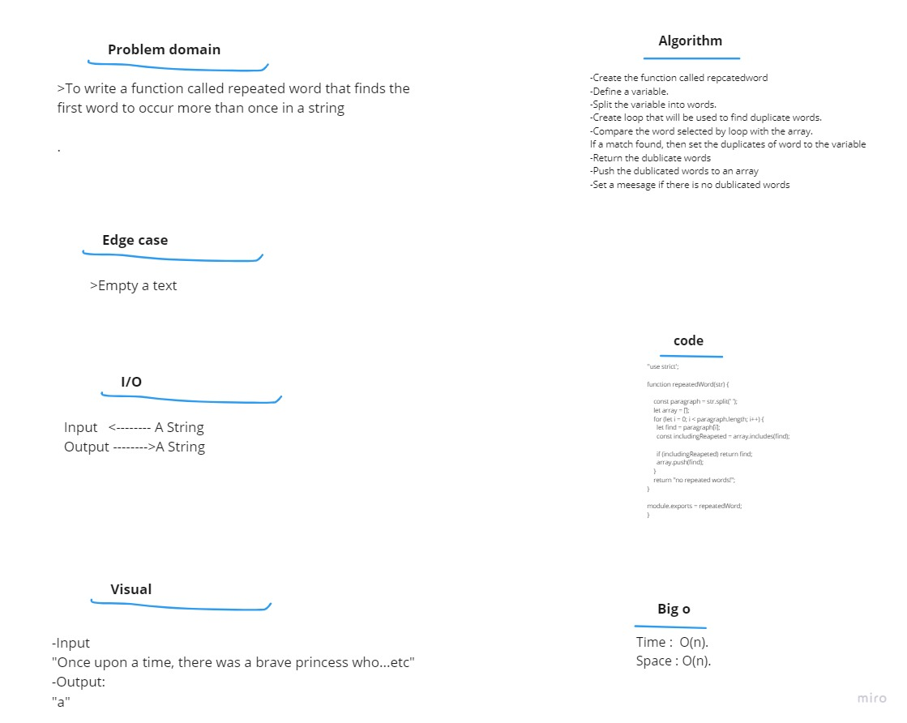

# Code challenge 31:

## Hashmap-Repeated-Word
<!-- Description of the challenge -->
- To write a function called repeated word that finds the first word to occur
more than once in a string
   - Arguments: string
   - Return: string

# Whiteboard Process
<!-- Embedded whiteboard image -->

## Approach & Efficiency
<!-- What approach did you take? Discuss Why. What is the Big O space/time for this approach? -->

- Big O 
   - Time <--- O(n)
   - Space <----- O(n)

---------------------------

### Solution  
- Create the function called repcatedword  
- Define a variable.  
- Split the variable into words.  
- Create loop that will be used to find duplicate words.  
- Compare the word selected by loop with the array.  
- If a match found, then set the duplicates of word to the variable  
- Return the dublicate words  
- Push the dublicated words to an array  
- Set a meesage if there is no dublicated words  