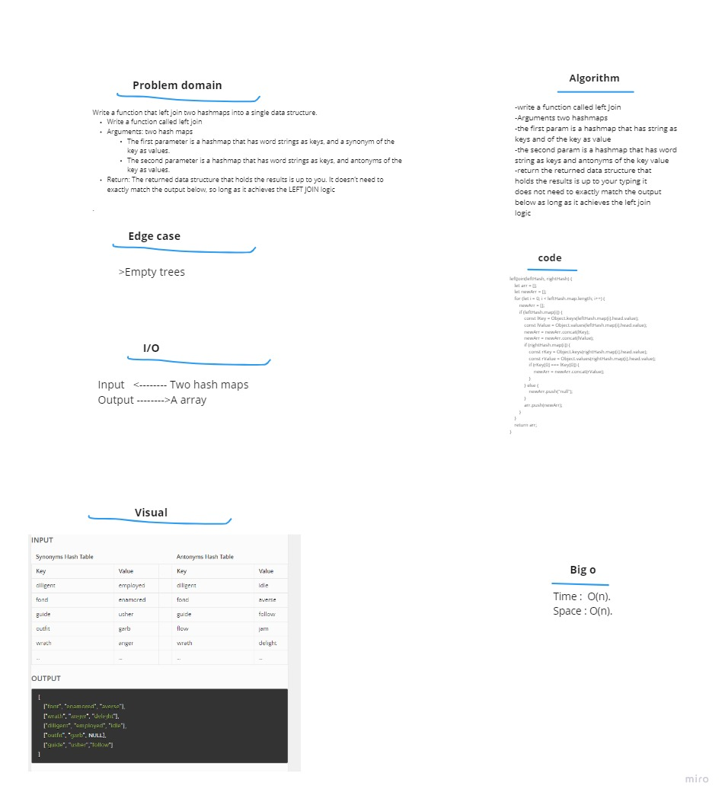

# Code challenge 33:

## Hash Table
<!-- Description of the challenge -->
- To Write a function that LEFT JOINs two hashmaps into a single data structure.
   - Arguments: two hash maps
     - The first parameter is a hashmap that has word strings as keys, and a synonym of the key as values.
     - The second parameter is a hashmap that has word strings as keys, and antonyms of the key as values.
    - Return: The returned data structure that holds the results is up to you. It doesn’t need to exactly match the output below, so long as it achieves the LEFT JOIN logic

### Whiteboard Process
<!-- Embedded whiteboard image -->

### Approach & Efficiency
<!-- What approach did you take? Discuss Why. What is the Big O space/time for this approach? -->

- Big O 
   - Time <--- O(n)
   - Space <----- O(n)

---------------------------

### solution  
- write a function called left Join  
- Arguments two hashmaps  
- the first param is a hashmap that has string as
keys and of the key as value  
- the second param is a hashmap that has word
string as keys and antonyms of the key value  
- return the returned data structure that  
holds the results is up to your typing it  
does not need to exactly match the output  
below as long as it achieves the left join  
logic  

