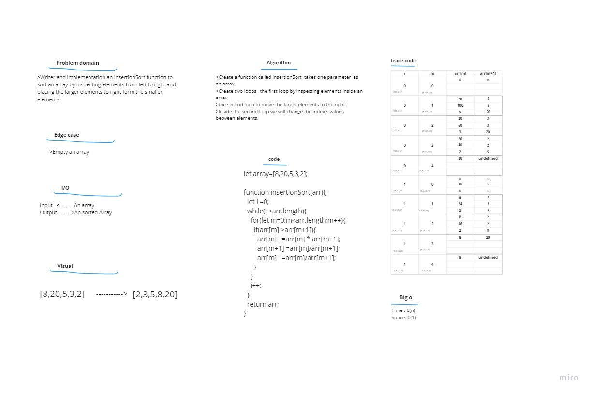

# Code challenge 26:

## Insertion Sort
<!-- Description of the challenge -->
- Write and implement a n insertion sort method to to sort an array by inspecting the elements from left to right and placing larger elements to the right of the smaller elements.

### Whiteboard Process
<!-- Embedded whiteboard image -->

### Approach & Efficiency
<!-- What approach did you take? Discuss Why. What is the Big O space/time for this approach? -->
- it took me 3 hours to solve it 

- Big O 
   - Time <--- O(n^2)
   - Space <----- O(1)

### Solution  
- Create a function called insertionSort  takes one parameter  as an array. 

- Create two loops , the first loop by inspecting elements inside an array.  

- the second loop to move the larger elements to the right.  

- Inside the second loop we will change the index's values between elements.

