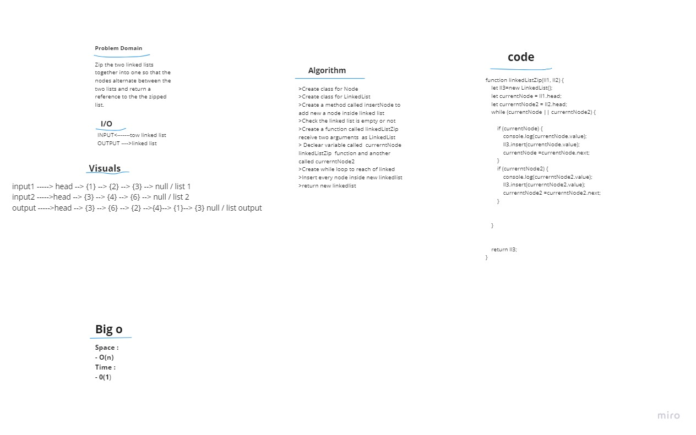

# Challenge Summary
<!-- Description of the challenge -->
write a function called linkedListZip, that takes two LinkedList as argument. and return the value that is new linked list contains two lists .

## Whiteboard Process  

  

## Approach & Efficiency  
<!-- What approach did you take? Why? What is the Big O space/time for this approach? -->    
I understood the problem first.  
I imagined how the results should be.  
I wrote the algorithm.  
I wrote the code.  
I made the tests.    

### Big O  
space o(n)  
time o(1)  

## Solution
<!-- Show how to run your code, and examples of it in action -->  

### Test

- `npm run test` 
- `npm run watch`

