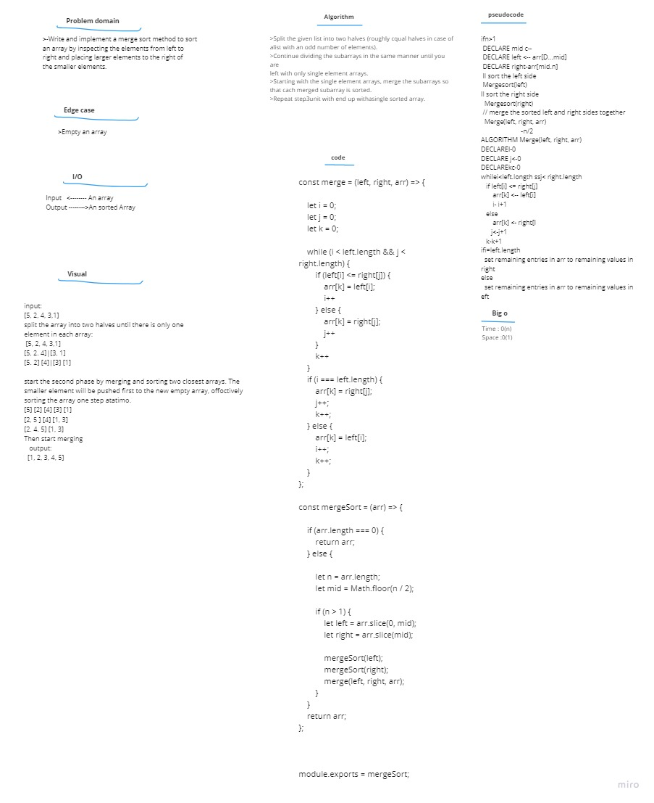

# Code challenge 27:

## merge Sort
<!-- Description of the challenge -->
- Write and implement a n merge sort method to to sort an array by inspecting the elements from left to right and placing larger elements to the right of the smaller elements.  

## Pseudocode  
        
    InsertionSort(int[] arr)

    FOR i = 1 to arr.length

      int j <-- i - 1
      int temp <-- arr[i]

      WHILE j >= 0 AND temp < arr[j]
        arr[j + 1] <-- arr[j]
        j <-- j - 1

      arr[j + 1] <-- temp    
       

 ### Code :   

     const mergeSort = (arr) => {

        if (arr.length === 0) {
        return arr;
         } else {

        let n = arr.length;
        let mid = Math.floor(n / 2);

        if (n > 1) {
            let left = arr.slice(0, mid);
            let right = arr.slice(mid);

            mergeSort(left);
            mergeSort(right);
            merge(left, right, arr);
        }
    }
    return arr;
    };
## Trace  

Sample Array: [8,20,5,3,2]  

- step 1:  
In the first step we will pass an unsort  array to mergeSort function and firstevl we will check the array contains more than elements if the array contains one element we don't need to merge it.  

        if (arr.length === 0) {
        return arr;}  
    
- step 2:  
the second step we will try to split the array into left and right using indentify the middle index.  

  

      let n = arr.length;
      let mid = Math.floor(n / 2); 
  
- step 3:  
now we will split the array into and left and right using slice method.

      let left = arr.slice(0, mid);
      let right = arr.slice(mid); 

- step 4:  
now we will do recursion in the left side of array and try to split it after that.

      mergeSort(left);

- step 5:  
now we will do recursion in the right side of array and try to split it.

      mergeSort(right);

- step 6:  
now we will invoke the merge function and pass left and right and array .

      mergeSort(right);

- step 7:  
now we will  merge left array and  right array using merge function this function will itrate and compared between elements inside arrays and push the small element into new array called combined.

      merge(left,right);

### merge function :
     function merge(array1, array2) {
    let combined = []
    let i = 0
    let j = 0
    while (i < array1.length && j < array2.length) {
        if (array1[i] < array2[j]) {
            combined.push(array1[i])
            i++
        } else {
            combined.push(array2[j])
            j++
        }
    }
    while (i < array1.length) {
        combined.push(array1[i])
        i++
    }
    while (j < array2.length) {
        combined.push(array2[j])
        j++
    }
    return combined;
    }

<!-- Embedded whiteboard image -->

### Efficiency
<!-- What approach did you take? Discuss Why. What is the Big O space/time for this approach? -->

 - Time: O(n^2)
The basic operation of this algorithm is comparison. This will happen n * (n-1) number of times…concluding the algorithm to be n squared.  

 - Space: O(1)
No additional space is being created. This array is being sorted in place…keeping the space at constant O(1).
