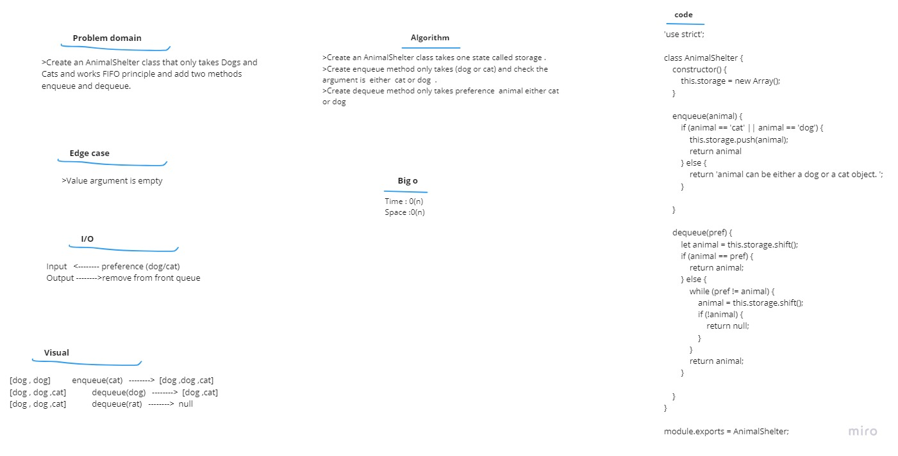

# Challenge Summary  
Create an AnimalShelter class that only takes Dogs and Cats and works FIFO principle and add two methods enqueue and dequeue.

# Approach & Efficiency

1. I understood the problem first.
1. I imagined how the results should be.
1. I wrote the algorithm.
1. I wrote the code.
1. I made the tests.

# Big O
Time <---O(n)       
Space <-----O(n) 
# whiteboard  

# Solution  
Create an AnimalShelter class takes one state called storage .  
Create enqueue method only takes (dog or cat) and check the argument is  either  cat or dog  .  
Create dequeue method only takes preference  animal either cat or dog.    
