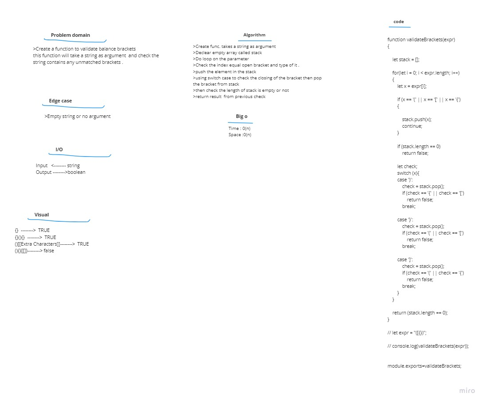

## Challenge  
 create a function that check for brackets violation in strings 

## Approach & Efficiency  

1. I understood the problem first
1. I imagined how the results should be
1. I made a visual representation.
1. I wrote an algorithm
1. I wrote the code
1. I made the tests   

## Big O
- Space :  
  - O(n)
- Time :  
  - O(n)  

## Whiteboard  

 

