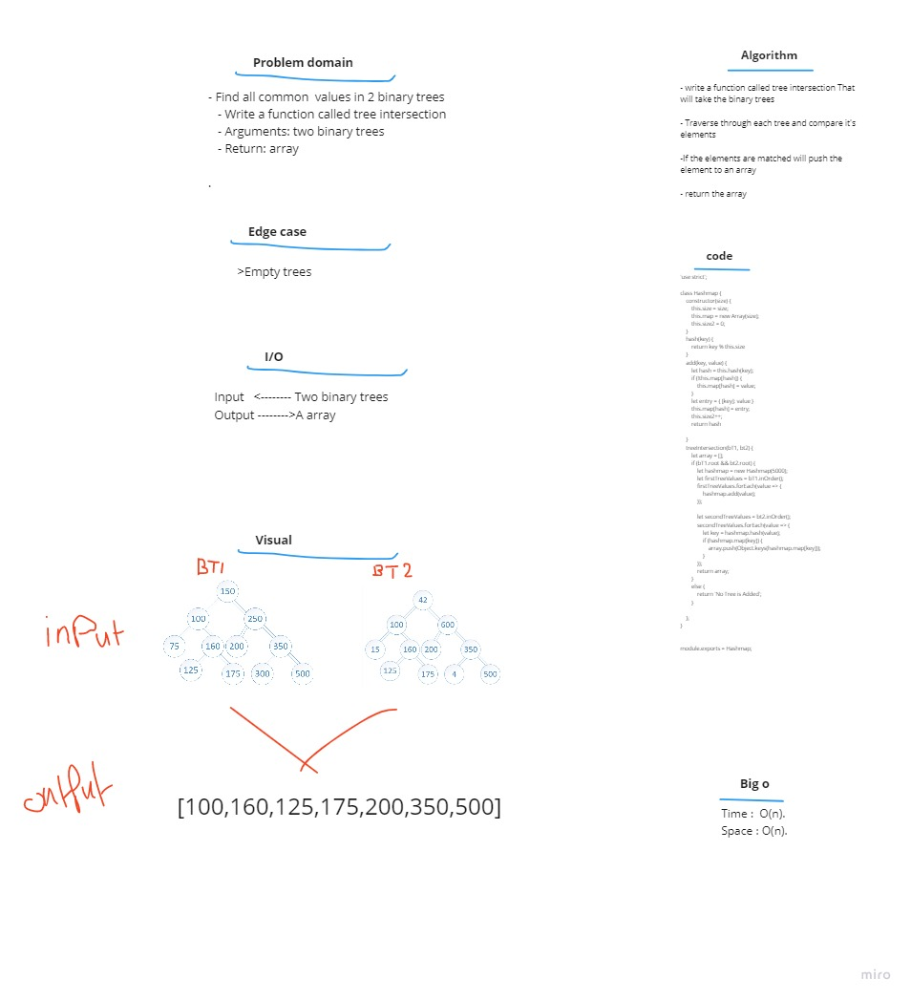

# Code challenge 32:

## Hashmap-Tree-Intersection
<!-- Description of the challenge -->
- Find all common  values in 2 binary trees
   - Write a function called tree intersection
   - Arguments: two binary trees
   - Return: array

### Whiteboard Process
<!-- Embedded whiteboard image -->

### Approach & Efficiency
<!-- What approach did you take? Discuss Why. What is the Big O space/time for this approach? -->

- Big O 
   - Time <--- O(n) we are iterating throught an array  
   - Space <----- O(n)  we created an array of length n  

---------------------------
### solution  
- write a function called tree intersection That  
will take the binary trees  

- Traverse through each tree and compare it's  
elements  

- If the elements are matched will push the  
element to an array  

- return the array  
