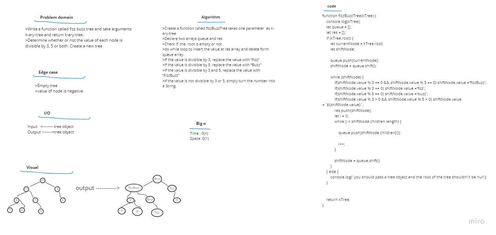

# Challenge Summary  
Write a function called fizz buzz tree and take arguments k-ary-tree and return k-ary-tree.  
Determine whether or not the value of each node is divisible by 3, 5 or both. Create a new tree

# Approach & Efficiency

1. I understood the problem first.
1. I imagined how the results should be.
1. I wrote the algorithm.
1. I wrote the code.
1. I made the tests.

# Big O
Time <---O(n)       
Space <-----O(n) 
# whiteboard  

# Solution  
>Create a function called fizzBuzzTree takes one parameter  as k-ary-tree  
>Declare two arrays queue and res  
>Check if  the  root is empty or not  
>do while loop to insert the value at res array and delete form queue array.  
>If the value is divisible by 3, replace the value with “Fizz”  
>If the value is divisible by 5, replace the value with “Buzz”  
>If the value is divisible by 3 and 5, replace the value with “FizzBuzz”  
>If the value is not divisible by 3 or 5, simply turn the number into a String.     
