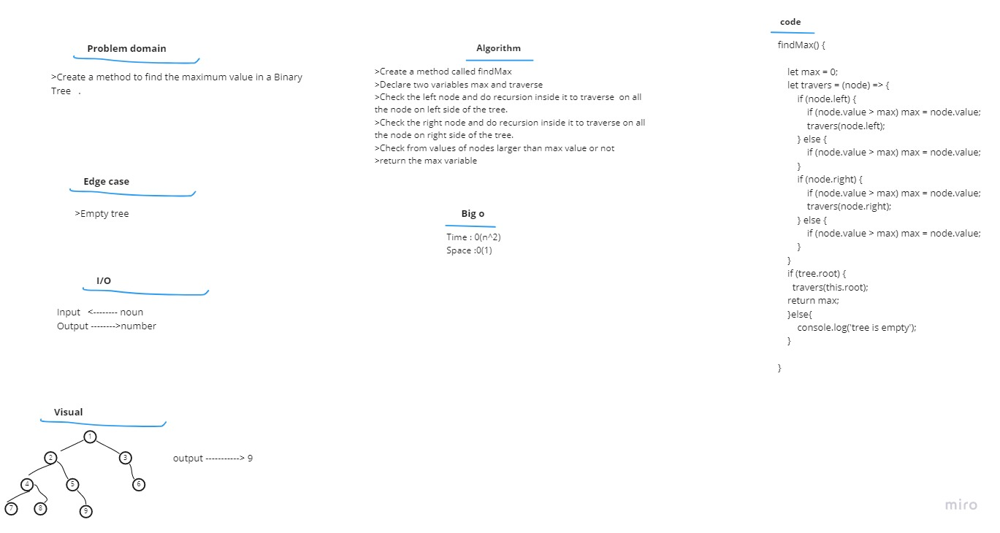

# Challenge Summary  
Find the Maximum Value in a Binary Tree

# Approach & Efficiency

1. I understood the problem first.
1. I imagined how the results should be.
1. I wrote the algorithm.
1. I wrote the code.
1. I made the tests.

# Big O
Time <---O(n^2)       
Space <-----O(n) 
# whiteboard  

# Solution  
>Create a method called findMax  
>Declare two variables max and traverse  
>Check the left node and do recursion inside it to traverse  on all the node on left side of the tree.  
>Check the right node and do recursion inside it to traverse on all the node on right side of the tree.  
>Check from values of nodes larger than max value or not  
>return the max variable      
