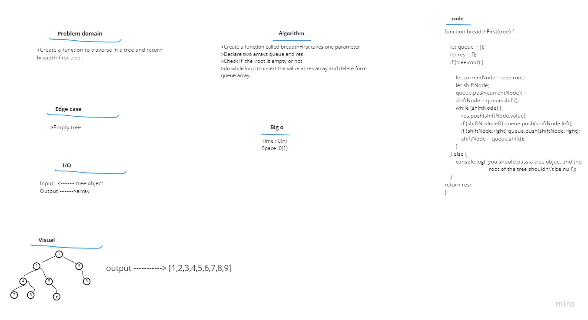

# Challenge Summary  
Create a function to traverse in a tree and return breadth-first-tree

# Approach & Efficiency

1. I understood the problem first.
1. I imagined how the results should be.
1. I wrote the algorithm.
1. I wrote the code.
1. I made the tests.

# Big O
Time <---O(n)       
Space <-----O(n) 
# whiteboard  

# Solution  
>Create a function called breadthFirst takes one parameter  
>Declare two arrays queue and res  
>Check if  the  root is empty or not  
>do while loop to insert the value at res array and delete form queue array.     
